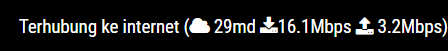

# MMM-NetworkConnection []

Network Connection Status (ping, download, upload) Module for MagicMirror<sup>2</sup>.
This module combines [internet-monitor](https://github.com/ronny3050/internet-monitor) and [MMM-connection-status](https://github.com/sheyabernstein/MMM-connection-status).

## Example



## Dependencies

* An installation of [MagicMirror<sup>2</sup>](https://github.com/MichMich/MagicMirror)
* [speedtest-net](https://www.npmjs.com/package/speedtest-net) module of nodejs

## Installation

1. Clone this repo into `~/MagicMirror/modules` directory.
2. Go to `~/MagicMirror/modules/MMM-NetworkConnection` directory and do `npm install`
3. Configure your `~/MagicMirror/config/config.js`:

    ```
    {
        module: 'MMM-NetworkConnection',
        position: 'top_right',
        config: {
        }
    }
    ```

## Config Options

| **Option** | **Default** | **Description** |
| --- | --- | --- |
| `updateInterval` | `600000 ms` (10 minutes) | how often should the devices states refreshed |
| `maxTime` | `5000` milliseconds | how long to do speedtest |
| `initialLoadDelay` | `2500` milliseconds | how long to delay to load the module |
| `decimal` | `1` | how many decimals for the round |
| `displayTextStatus` | `true` | display connection text status or not |
| `animationSpeed` | `2500` milliseconds | speed of the update animation |
